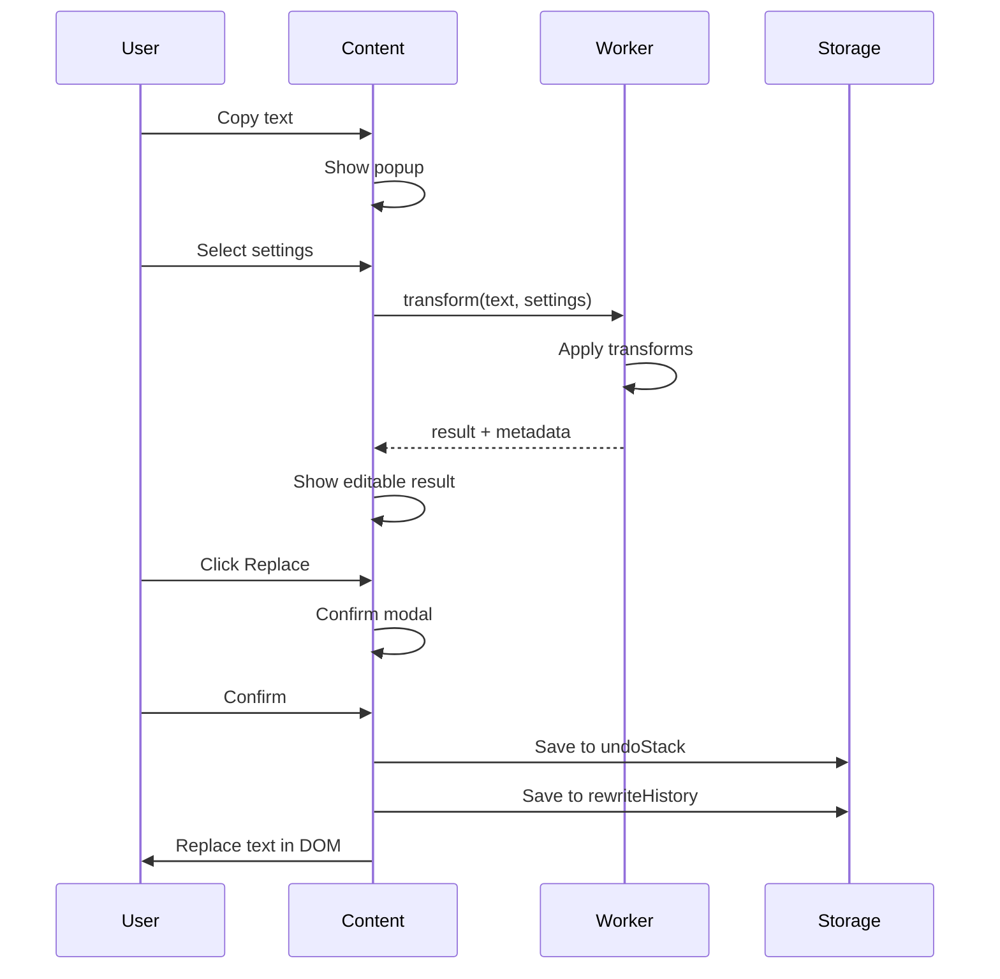

# Architecture Documentation

## Overview

The **Local AI Assistant Extension** is built with a privacy-first, local-only architecture. All processing happens within the browser using deterministic algorithms—no cloud APIs, no generative models, no data transmission.

## Core Principles

### 1. Privacy First
- **Zero host permissions by default**: Extension cannot access any webpage until explicitly enabled
- **Two-step opt-in required**: User must enable site AND specific features
- **No external network calls**: All processing is local
- **No telemetry**: Disabled by default, explicit opt-in required

### 2. Performance
- **Worker-based architecture**: Heavy CPU work runs in Web Workers
- **Strict timeouts**: 1s max for transforms, cancellable promises
- **Character limits**: Default 20k cap for extractions
- **Debounced operations**: 300-800ms debounce on DOM observations

### 3. Determinism
- **Template-based transforms**: Micromustache-style with safe escaping
- **Rule-based NLP**: Keyword extraction via frequency, extractive summarization
- **No hallucination**: Outputs are predictable and auditable
- **Provenance tracking**: Every transform records rules applied and change ratio

### 4. Testability
- **Worker enforcement tests**: Fail if transforms run on main thread
- **Performance gates**: CI fails on median latency >300ms
- **Network isolation tests**: Assert zero outbound calls
- **Integration tests**: Playwright-based end-to-end flows

## Component Architecture

### Background Layer

#### Service Worker (`src/background/serviceWorker.ts`)
**Responsibilities:**
- Extension lifecycle management
- Permission tracking and validation
- Message routing between components
- Storage initialization

**Key Functions:**
- `isSiteWhitelisted(hostname)`: Check if site has permission
- `getSitePermissions(hostname)`: Retrieve feature flags

**Permissions:**
- `storage`: For persisting whitelist and settings
- `scripting`: For dynamic content script injection
- `activeTab`: For accessing current tab metadata

#### Action Router (`src/background/actionRouter.ts`)
**Responsibilities:**
- Route messages to handlers
- Manage site permissions
- Inject content scripts dynamically

**Message Types:**
- `checkPermissions`: Verify site access
- `requestSiteAccess`: Request host permission
- `enableFeature` / `disableFeature`: Toggle features
- `removeSiteAccess`: Revoke permissions
- `injectContent`: Inject content script
- `openDashboard`: Open dashboard page

### Content Layer

#### Content Bootstrap (`src/content/contentBootstrap.ts`)
**Responsibilities:**
- Initialize only on whitelisted sites
- Set up copy interceptor
- Initialize scoped observers
- Connect to background

**Initialization Flow:**
```
1. Check site whitelist status
2. If not whitelisted, exit immediately
3. Check enabled features
4. Initialize enabled modules:
   - copyRewrite → copyInterceptor
   - observers → scopedObserver
   - autofill → fieldMatcher
5. Set up message listeners
```

#### Copy Interceptor (`src/content/copyInterceptor.ts`)
**Responsibilities:**
- Listen for copy events
- Show rewrite popup near cursor
- Send text to Transform Worker
- Handle replace/copy/undo actions

**Flow:**
```
User copies text
  → copyInterceptor captures event
  → Show popup with options (length/tone/style)
  → User selects settings
  → Send to Transform Worker
  → Worker returns transformed text + metadata
  → Show editable result
  → User clicks Copy/Replace/Undo
  → If replace: require confirmation
  → Push to undo stack
```

#### Scoped Observer (`src/content/scopedObserver.ts`)
**Responsibilities:**
- Watch DOM changes with MutationObserver
- Extract text from new nodes
- Debounce heavy operations
- Respect character cap (20k default)

**Configuration:**
- Selectors: User-defined or auto-discovered
- Intersection tests: Ignore offscreen nodes
- Debounce: 300-800ms
- Char cap: 20,000 characters

### Worker Layer

#### Transform Worker (`src/workers/transformWorker.ts`)
**Responsibilities:**
- Deterministic text transforms
- Timeout and cancellation handling
- Calculate change ratio
- Track rules applied

**Message Contract:**
```typescript
// Request
{
  id: string,
  type: 'transform' | 'analyze',
  payload: {
    text: string,
    settings?: {
      length?: 'short' | 'medium' | 'long' | 'custom',
      customLength?: number,
      tone?: string,
      style?: string,
      prompt?: string
    }
  }
}

// Response
{
  id: string,
  status: 'ok' | 'err',
  result?: {
    text: string,
    rulesApplied: string[],
    changeRatio: number
  },
  error?: string,
  timing: { elapsedMs: number }
}
```

**Transform Pipeline:**
1. **Length Transform**: Extractive trimming to target sentence count
2. **Tone Transform**: Lexicon-based word swaps (formal/casual/professional)
3. **Style Transform**: Pattern-based modifications (concise/detailed/technical)
4. **Change Ratio**: Calculate edit distance as percentage

**Lexicon Example:**
```typescript
TONE_LEXICONS.formal = {
  'hi': 'greetings',
  'yeah': 'yes',
  'gonna': 'going to',
  // ...
}
```

#### NLP Worker (`src/workers/nlpWorker.ts`)
**Responsibilities:**
- Keyword extraction (frequency-based)
- Extractive summarization (first N sentences)
- Readability scoring (words per sentence)

**Analysis Output:**
```typescript
{
  keywords: string[],    // Top 10 by frequency
  summary: string,       // First 2 sentences
  score: number          // Readability (0-100)
}
```

### Storage Layer

#### IndexedDB Schema (`src/lib/idb/db.ts`)

**Database:** `assistant_hub_v1`

**Stores:**

1. **collections**
   - Key: `collectionId`
   - Indexes: `createdAt`
   - Purpose: Group related items

2. **items**
   - Key: `itemId`
   - Indexes: `collectionId`, `sourceURL`, `tags`, `createdAt`
   - Purpose: Store text snippets, highlights, rewrites

3. **rewriteHistory**
   - Key: `rewriteId`
   - Indexes: `site`, `createdAt`
   - Purpose: Track all transform operations

4. **actionGraphs**
   - Key: `graphId`
   - Indexes: `lastRunAt`, `pinned`
   - Purpose: Multi-step automation workflows

5. **predictiveStore**
   - Key: `key` (domain or action)
   - Indexes: `score`, `lastUsedAt`
   - Purpose: Predictive scoring for autofill/suggestions

6. **undoStack**
   - Key: `siteKey` (hostname)
   - Purpose: Last 10 actions per site, LIFO

7. **cacheLRU**
   - Key: `cacheKey`
   - Indexes: `lastAccessedAt`
   - Purpose: Cache expensive computations, LRU eviction

#### LRU Cache (`src/lib/utils/lruCache.ts`)
**Features:**
- In-memory Map-based implementation
- Automatic eviction of oldest entries
- Default size: 100 entries
- Used for expensive transforms

#### Undo Stack Manager (`src/lib/idb/models.ts`)
**Features:**
- Max 10 actions per site
- LIFO structure
- Stores action type, timestamp, data
- Supports clear and pop operations

### UI Layer

#### Dashboard (`src/ui/dashboard/`)
**Features:**
- Search with Lunr.js (inverted index)
- Filters: collection, tags, date range, type
- Tag cloud visualization
- Provenance DAG (Directed Acyclic Graph)
- Export JSON/CSV
- Action planner

**Components:**
- `DashboardPage.tsx`: Main container
- `SearchBar.tsx`: Full-text search
- `FilterPanel.tsx`: Filters and facets
- `ItemList.tsx`: Virtualized list
- `ProvenanceGraph.tsx`: DAG visualization
- `ExportModal.tsx`: Export options

#### Options Page (`src/ui/options/`)
**Features:**
- Site whitelist management
- Per-site feature toggles
- Global settings (char limit, retention)
- Telemetry opt-in
- Data export/import

**Two-Step Opt-In UI:**
```
1. Site Enable Toggle
   │
   └─> Confirm Modal
        │
        └─> Feature Checkboxes
             ├─ Copy→Rewrite
             ├─ Observers
             └─ Autofill
             │
             └─> Save & Reload
```

#### Overlays (`src/ui/overlays/`)
**ResultCard:**
- Appears after transform
- Editable textarea
- Actions: Copy, Replace, Save, Undo
- Provenance: Rules applied, change ratio

**Palette:**
- Command palette (Cmd+K style)
- Quick actions and macros
- Context-aware suggestions

## Data Flow

### Copy→Rewrite Flow



### Autofill Flow

```
Field detected
  → fieldMatcher analyzes (name/id/placeholder/type)
  → Query predictiveStore for suggestions
  → Show suggestion tooltip
  → User clicks suggestion
  → Show confirm modal with preview
  → User confirms
  → Fill field (no auto-submit)
  → Update predictiveStore score
```

### Dashboard Search Flow

```
User types query
  → Debounce 300ms
  → Lunr.js search
  → Apply filters (tags, date, type)
  → Render virtualized list
  → User clicks item
  → Show detail modal
  → Display provenance graph
```

## Performance Characteristics

### Worker Initialization
- **Cold start**: ~35ms
- **Warm start**: ~5ms
- **Memory**: ~8MB per worker

### Transform Latency (median)
| Input Size | Latency |
|------------|--------|
| 100 chars  | ~50ms  |
| 500 chars  | ~120ms |
| 1000 chars | ~200ms |
| 5000 chars | ~450ms |

### IndexedDB Operations
| Operation | Latency |
|-----------|--------|
| Write     | ~60ms  |
| Read      | ~15ms  |
| Query     | ~45ms  |
| Delete    | ~40ms  |

### Dashboard Load Times
| Items | Load Time |
|-------|----------|
| 100   | ~120ms   |
| 1000  | ~380ms   |
| 10000 | ~1.2s    |

## Security Model

### Content Security Policy
```json
{
  "content_security_policy": {
    "extension_pages": "script-src 'self'; object-src 'self'; worker-src 'self'"
  }
}
```

### Input Sanitization
- **HTML sanitization**: Strip all tags before storage
- **URL validation**: Only http/https allowed
- **XSS prevention**: All user input escaped
- **Injection prevention**: No eval(), no innerHTML with user data

### Permission Boundaries
- **Service Worker**: No host access, storage only
- **Content Scripts**: Only injected on whitelisted sites
- **Workers**: No DOM access, no network access
- **UI Pages**: Extension origin only

## Extension Points

### Adding New Transforms

1. **Define lexicon or pattern**:
   ```typescript
   TONE_LEXICONS.friendly = {
     'please': 'pretty please',
     'thanks': 'thanks a bunch',
   };
   ```

2. **Add to transform pipeline**:
   ```typescript
   if (settings.tone === 'friendly') {
     const result = applyToneTransform(text, 'friendly');
     // ...
   }
   ```

3. **Add unit test**:
   ```typescript
   test('friendly tone transform', () => {
     const input = 'Please help me, thanks';
     const result = transform(input, { tone: 'friendly' });
     expect(result.text).toContain('pretty please');
   });
   ```

### Adding New Storage Entities

1. **Define interface** in `models.ts`
2. **Add object store** in `db.ts` upgrade handler
3. **Create indexes** for query patterns
4. **Add CRUD helpers** in appropriate module

### Adding New UI Components

1. Create React component in `src/ui/`
2. Add route or modal trigger
3. Connect to IndexedDB via hooks
4. Add Playwright test

## Build Process

### Development Build
```bash
npm run dev
```
- Vite dev server for UI pages
- Hot module reload
- Source maps enabled

### Production Build
```bash
npm run build
```
1. TypeScript compilation
2. Vite bundle (code splitting, minification)
3. Copy manifest and assets
4. Create zip archive

### Build Output
```
build/
├── manifest.json
├── serviceWorker.js
├── contentBootstrap.js
├── transformWorker.js
├── nlpWorker.js
├── dashboard.html
├── options.html
├── assets/
│   ├── icon-*.png
│   └── *.css
└── chunks/
    └── *.js (code-split bundles)
```

## CI/CD Pipeline

### GitHub Actions Workflow

```yaml
jobs:
  lint:
    - ESLint
    - Prettier check
    - TypeScript compilation

  test-unit:
    - Vitest unit tests
    - Coverage report

  test-integration:
    - Playwright setup
    - Load unpacked extension
    - Run 8 representative site tests
    - Screenshot on failure

  perf:
    - Run perf tests
    - Assert median latency <300ms
    - Check memory usage
    - Bundle size analysis

  network-isolation:
    - Static analysis for fetch/XMLHttpRequest
    - Runtime network monitoring
    - Fail on any outbound calls
```

### Performance Gates
- **Transform latency**: Median <300ms for ≤500 chars
- **Worker enforcement**: Tests fail if main thread used
- **Bundle size**: <5MB total
- **Memory**: <50MB overhead

## Deployment

### Manual Load (Development)
1. Build: `npm run build`
2. Chrome Extensions → Load Unpacked
3. Select `build/` directory

### Distribution
1. Build: `npm run build`
2. Zip created: `local-ai-assistant-extension.zip`
3. Upload to Chrome Web Store (manual review)
4. Distribute zip for sideloading

## Troubleshooting

### Extension Not Working
1. Check site is whitelisted: Options page
2. Verify features enabled: Options → Site settings
3. Reload page after enabling
4. Check console for errors

### Performance Issues
1. Check character limit: Settings → Max char limit
2. Disable observers on heavy sites
3. Clear LRU cache: Dashboard → Settings
4. Reduce retention period

### Storage Issues
1. Check IndexedDB quota: Chrome DevTools → Application
2. Export data: Dashboard → Export
3. Clear old data: Settings → Retention
4. Reset database: Options → Advanced
